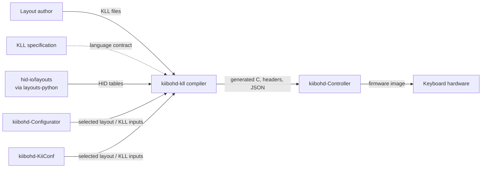
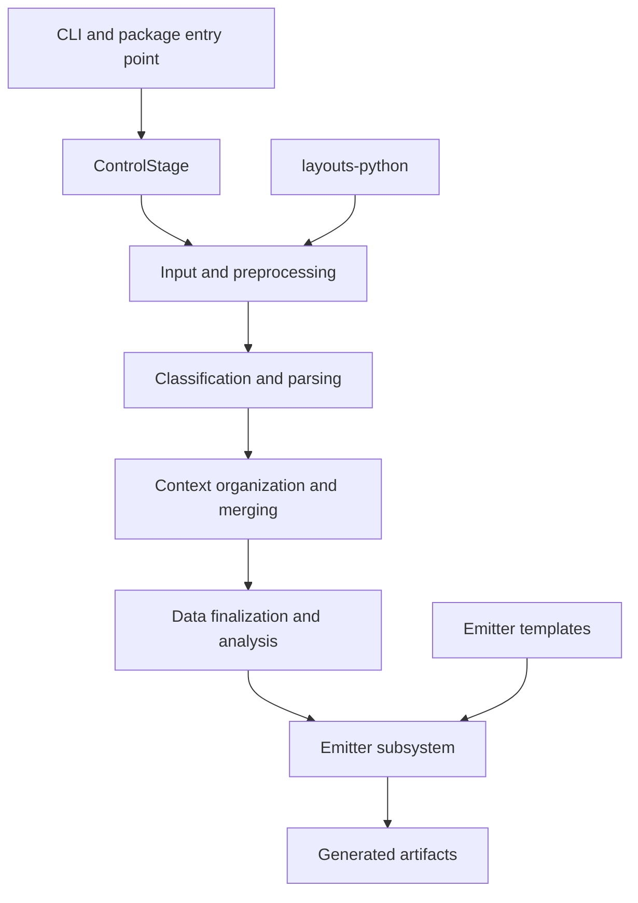
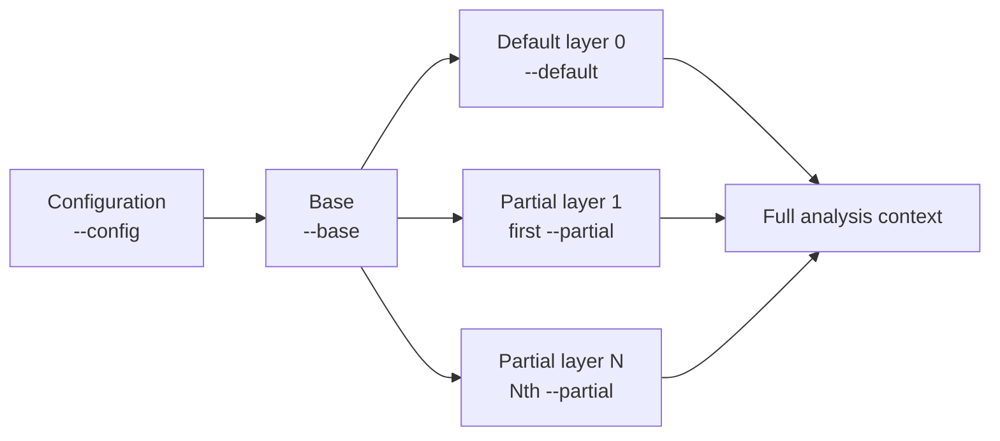
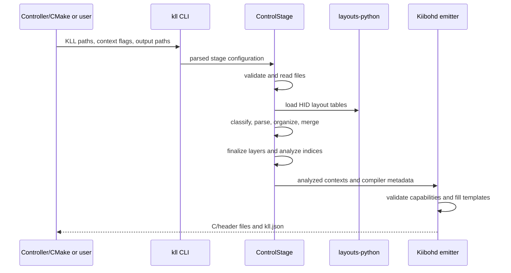
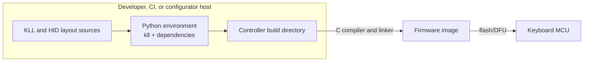

# kiibohd-kll architecture

This document follows the [arc42](https://arc42.org/) template. It describes
the KLL compiler in this repository, version 0.5.x.

## 1. Introduction and goals

### 1.1 Purpose

`kiibohd-kll` compiles Keyboard Layout Language (KLL) source files into
artifacts used by keyboard firmware builds and supporting tools. Its primary
target is Kiibohd Controller firmware, but its staged compiler and emitter
boundary also support syntax checking, normalized KLL output, and compiler
state inspection.

KLL itself is defined by the external
[KLL specification](https://github.com/kiibohd/kll-spec).

### 1.2 Quality goals

1. **Correctness:** reject malformed or incompatible layouts before firmware is
   built, and preserve KLL merge and operator semantics.
2. **Determinism:** identical sources, layout data, compiler version, options,
   and templates produce equivalent generated artifacts.
3. **Integration stability:** keep the command-line and generated-file
   contracts usable by Kiibohd Controller and downstream configurators.
4. **Diagnosability:** associate errors and generated metadata with source
   files, lines, compiler arguments, and compiler revision.
5. **Extensibility:** isolate output-specific behavior behind emitters while
   sharing parsing, context merging, and analysis.

### 1.3 Stakeholders

| Stakeholder | Need |
| --- | --- |
| Firmware developers | Generate C headers, C data, and HID definitions accepted by Controller builds. |
| Layout authors | Validate KLL syntax and obtain predictable layer composition. |
| Configurator developers | Turn user-selected layouts into KLL inputs and consume generated metadata. |
| Compiler maintainers | Change language handling without silently breaking firmware targets. |
| CI and release maintainers | Test supported Python versions, packaging, and Controller integration. |

## 2. Architecture constraints

- The language and its compatibility expectations come from
  [kll-spec](https://github.com/kiibohd/kll-spec).
- The implementation is a Python package and command-line program. Packaging
  uses Flit and exposes the `kll` entry point.
- The compiler depends on `layouts`, supplied by
  [layouts-python](https://github.com/hid-io/layouts-python), for HID usage
  tables and C definitions. That package normally obtains its data from
  [hid-io/layouts](https://github.com/hid-io/layouts).
- Offline and reproducible environments must provide an existing
  `hid-io/layouts` checkout through `--layouts-path` or `KLL_LAYOUTS_PATH`.
  When either is set, the compiler does not contact GitHub.
- Kiibohd output is constrained by Controller's generated-file interfaces and
  capability names.
- Source files and command-line list order are significant because later
  contexts and expressions can modify earlier ones.
- The repository is GPL-3.0-or-later licensed.

## 3. Context and scope

### 3.1 Business context



The sibling consumers are:

- [kiibohd-Controller architecture](../../../kiibohd-Controller/docs/arc42/index.md)
  ([queue task](https://github.com/users/MarkDrei/projects/1/views/1?pane=issue&itemId=245893628)):
  the primary consumer, which invokes KLL during its CMake firmware build.
- [kiibohd-Configurator architecture](../../../kiibohd-Configurator/docs/arc42/index.md)
  ([queue task](https://github.com/users/MarkDrei/projects/1/views/1?pane=issue&itemId=245893640)):
  a desktop layout editor and local compile/flash workflow.
- [kiibohd-KiiConf architecture](../../../kiibohd-KiiConf/docs/arc42/index.md)
  ([queue task](https://github.com/users/MarkDrei/projects/1/views/1?pane=issue&itemId=245893631)):
  the historical web configurator and server-side firmware compile workflow.

These relative links assume the repositories are sibling checkouts under one
directory, as in the development workspace. Consumers should link to this
document from their own context and build-boundary descriptions.

### 3.2 Technical context

Inputs:

- generic KLL files passed positionally;
- configuration/capability files passed with `--config`;
- scan-code base maps passed with `--base`;
- default layer files passed with `--default`;
- zero or more ordered partial layers, each introduced by `--partial`;
- HID layout data from the `layouts` dependency;
- emitter selection, output paths, and optional emitter templates.

Outputs of the default `kiibohd` emitter:

- `kll_defs.h`: compiler-derived definitions used by firmware;
- `generatedKeymap.h`: layers, trigger/result mappings, and capabilities;
- `usb_hid.h`: HID lookup definitions;
- `generatedPixelmap.c`: pixel and animation data when relevant;
- `kll.json`: expanded compiler data for tests and supporting tools.

Other registered emitters are `kll` (normalized KLL files), `state`
(inspection output), and `none` (validation without generated artifacts).

### 3.3 Compile-time versus runtime boundary

The compiler runs on the developer, CI, or configurator host **at firmware
compile time**. It reads text and writes generated source/data files. Controller
then compiles those files into a firmware image.

At **keyboard runtime**, no Python compiler, KLL parser, source KLL file,
`layouts` checkout, or compiler network access is present. Controller firmware
interprets the generated tables while scanning keys, selecting layers,
dispatching capabilities, and driving outputs. Runtime defects in those tables
can originate in compiler input or generation, but the compiler itself is not a
runtime component.

## 4. Solution strategy

- Use a fixed, fail-fast pipeline whose stages expose their results through one
  shared `ControlStage`.
- Assign every input file to a typed context before parsing: configuration,
  base map, default map, partial map, or generic.
- Parse KLL in two passes: first classify expression boundaries and operators,
  then tokenize and parse operation-specific operands.
- Store parsed expressions in typed organization stores, retaining source and
  connection metadata.
- Merge like contexts in command-line order, then compose configuration, base,
  default, and partial contexts according to layer semantics.
- Reduce symbolic mappings and precompute compact lookup structures before
  output generation.
- Keep target rendering in emitters. The Kiibohd emitter fills versioned text
  templates and produces JSON from the same analyzed model.
- Exercise parser behavior independently and validate the main emitter against
  a real Controller checkout in CI.

## 5. Building block view

### 5.1 Level 1



### 5.2 Level 2

| Building block | Responsibility | Main implementation |
| --- | --- | --- |
| Entry point | Parse global and stage-owned CLI options, start compilation. | `kll/__init__.py`, `kll/__main__.py` |
| Pipeline controller | Construct stages, execute them in order, stop after an incomplete stage. | `kll/common/stage.py` (`ControlStage`, `Stage`) |
| File model | Validate and read each source while retaining its typed context. | `kll/common/file.py`, `kll/common/context.py` |
| Preprocessor | Load HID layouts, seed contexts, and determine connection/scan-code offsets. | `PreprocessorStage` in `kll/common/stage.py` |
| Parser | Classify statements by operator, then parse operation-specific operands into expression objects. | `OperationClassificationStage`, `OperationSpecificsStage`, `kll/common/parse.py`, `kll/common/expression.py` |
| Organization model | Store assignments, mappings, associations, capabilities, defines, and positions by semantic key. | `kll/common/organization.py` |
| Context composer | Merge same-type files and build base, default, partial, and full contexts. | `DataOrganizationStage`, `DataFinalizationStage`, `MergeContext` |
| Analyzer | Reduce USB triggers to scan codes and build indices, trigger lists, offsets, positions, animations, and strings. | `DataAnalysisStage` |
| Emitter registry | Select one or more registered output backends. | `kll/emitters/emitters.py` |
| Kiibohd emitter | Validate firmware capabilities and render Controller C/header/JSON outputs. | `kll/emitters/kiibohd/kiibohd.py`, `kll/templates/` |

### 5.3 Context composition

Files within each category are merged in the order supplied. For ordinary
keyed data, later values replace earlier values; mapping operators can instead
append, remove, isolate, or lazily replace according to the KLL language.



- `--config`: capability and global configuration definitions; earliest
  priority.
- `--base`: physical scan map and base mappings, overlaid on configuration and
  inherited by every layer.
- `--default`: mappings overlaid on the base to form layer 0.
- each `--partial`: one additional layer. It starts from the composed base, not
  from the default layer, and receives the files supplied to that occurrence
  in their listed order.
- positional generic files are auto-context inputs. In the final composition,
  they can seed compilation when no configuration context exists, or overlay a
  configuration context before the base map.

## 6. Runtime view

This section describes the compiler process runtime. It must not be confused
with the keyboard firmware runtime excluded in section 3.3.

### 6.1 Successful Kiibohd compilation



The ordered stages are:

1. `CompilerConfigurationStage`
2. `FileImportStage`
3. `PreprocessorStage`
4. `OperationClassificationStage`
5. `OperationSpecificsStage`
6. `OperationOrganizationStage`
7. `DataOrganizationStage`
8. `DataFinalizationStage`
9. `DataAnalysisStage`
10. `CodeGenerationStage`

Each stage must report `Completed`. An incomplete stage prevents subsequent
stages from running. File reads and selected per-context parsing work use a
thread pool sized by `--jobs`; semantic stages still have a fixed order.

### 6.2 Controller invocation

A representative Controller-style invocation is:

```text
kll \
  --config <device-capabilities.kll> <macro-capabilities.kll> <output-capabilities.kll> \
  --base <scan-map.kll> \
  --default <default-layout.kll> <function-map.kll> \
  --partial <layer-1.kll> <function-map.kll> \
  --partial <layer-2.kll> \
  --emitter kiibohd \
  --def-output <build>/kll_defs.h \
  --map-output <build>/generatedKeymap.h \
  --hid-output <build>/usb_hid.h \
  --pixel-output <build>/generatedPixelmap.c \
  --json-output <build>/kll.json
```

Controller owns target selection, the CMake build, C compilation, linking, and
firmware image generation. KLL owns only the language-to-artifact step.

### 6.3 Failure behavior

- Missing or unreadable source paths stop file import.
- Lexing, parsing, context organization, and capability errors mark their stage
  or emitter incomplete and return a failing process.
- An unknown emitter or invalid global option is rejected during CLI setup.
- Missing templates fail output generation.
- Without an explicit local layouts path, first use may need network access to
  populate the external layouts cache; offline builds should always set the
  path explicitly.

## 7. Deployment view



KLL is installed as a Python package or run from a checkout. It is not a
long-running service and owns no database. Its persistent products are files
written to caller-selected paths. CI uses an explicit `hid-io/layouts` checkout
and a Controller checkout; this removes hidden network access during tests and
checks the real firmware integration contract.

## 8. Cross-cutting concepts

### 8.1 Source traceability

`KLLFile`, `Context`, and expressions retain paths, line positions, connection
IDs, and layer identity. Generated Kiibohd metadata includes compiler
arguments, revision information, and source layout information where
applicable.

### 8.2 Error handling

Stages use `Queued`, `Running`, `Completed`, and `Incomplete` states. Expected
input failures print diagnostics and halt the pipeline. Some emitter checks
accumulate errors through `error_exit` so one run can report more than one
generation problem.

### 8.3 Concurrency

A shared thread pool accelerates independent file and context operations.
Context composition, semantic precedence, analysis, and emission remain
ordered. New parallel work must not mutate shared semantic stores
nondeterministically.

### 8.4 HID data and offline operation

The preprocessor constructs a `layouts.Layouts` manager. `--layouts-path`
overrides `KLL_LAYOUTS_PATH`; an explicit path reads local data as-is and
disables GitHub access. CI pins the data by checking it out into the workspace.

### 8.5 Generated-code boundary

Emitters consume finalized/analyzed contexts rather than reparsing source.
Text emitters replace tags in files under `kll/templates`; the JSON emitter
serializes an ordered dictionary. Generated files should be treated as build
artifacts and regenerated from KLL sources rather than hand-edited.

### 8.6 Compatibility and versioning

The package exposes a compiler version and a last-compatible version. The
Kiibohd emitter includes revision/dirty-state information when the compiler is
run from a Git checkout. Compatibility changes should be coordinated with the
specification and tested against Controller.

### 8.7 Security and trust

KLL inputs, HID layout data, and templates are trusted build inputs. The
compiler reads them and writes to paths selected by the caller. Build systems
should pin dependency revisions, use a local layouts checkout, review custom
templates, and avoid compiling untrusted layouts in a privileged workspace.
No compiler component belongs in the device's runtime trust boundary.

## 9. Architecture decisions

### 9.1 Fixed staged pipeline

**Decision:** run specialized stages through a shared controller in a fixed
order.

**Rationale:** later semantic work requires complete results from earlier
parsing and composition, while explicit stage status gives a single failure
boundary.

**Consequence:** stages are coupled through `ControlStage.stage(...)`, so
reordering or independently reusing stages requires care.

### 9.2 Typed contexts and late composition

**Decision:** parse files into separate typed contexts and merge only after
expression organization.

**Rationale:** configuration, physical maps, default mappings, and partial
layers have different precedence and inheritance rules.

**Consequence:** command-line grouping and order are part of the compiler's
public semantics.

### 9.3 Emitter-based outputs

**Decision:** place target-specific generation behind emitter classes.

**Rationale:** parsing and analysis are reusable across firmware generation,
KLL regeneration, state inspection, and syntax-only runs.

**Consequence:** a new emitter must be registered explicitly and must respect
the shared analyzed model.

### 9.4 External HID layout source

**Decision:** delegate HID usage definitions to `layouts-python` and
`hid-io/layouts`.

**Rationale:** this avoids maintaining a second HID data source in the compiler.

**Consequence:** reproducible/offline builds must explicitly provision and pin
the layouts repository.

### 9.5 Generated firmware tables

**Decision:** resolve and compact layout semantics on the host, then emit static
tables for Controller.

**Rationale:** host-side analysis can be richer while keyboard firmware remains
small and does not need a parser.

**Consequence:** changing generated structures is an integration change for
Controller even if the KLL CLI remains stable.

## 10. Quality requirements

| Scenario | Expected response |
| --- | --- |
| A source contains invalid KLL syntax. | Compilation fails before emission and identifies the source location. |
| Two files define the same ordinary key in one context. | The later definition wins consistently; explicit mapping operators retain their specified append/remove/lazy behavior. |
| Two partial layers are supplied. | Layer 0 is the default context; each `--partial` occurrence creates the next independently base-derived layer. |
| A developer compiles without network access. | With `--layouts-path` or `KLL_LAYOUTS_PATH`, all HID data is read locally and no GitHub request occurs. |
| A change breaks Controller's generation contract. | Firmware integration tests using a Controller checkout fail in CI. |
| The same build is repeated with pinned inputs and environment. | It produces equivalent semantic output without dependence on mutable remote layout data. |
| A new output representation is needed. | It can be implemented as an emitter without duplicating the parser and context pipeline. |
| Compilation fails midway. | No later stage runs; diagnostics expose the failed stage/input rather than producing apparently successful final output. |

## 11. Risks and technical debt

- Stages discover one another by class-name strings and share mutable objects
  through the controller; this creates implicit coupling.
- The parser vendors `funcparserlib` code under `kll/extern`, increasing
  maintenance and compatibility responsibility.
- Network-backed default HID data can undermine reproducibility unless callers
  set an explicit layouts path.
- Generated C structures form a tight, partly implicit contract with
  Controller. Cross-repository CI is required to detect drift.
- Several modules are large and combine analysis, validation, and formatting,
  which raises the cost of isolated testing.
- Error reporting mixes status returns, printed diagnostics, assertions, and
  process exits.
- The shared thread pool and mutable context model constrain safe future
  parallelization.
- The `configurator` emitter implementation exists in the source tree but is
  not registered in the active emitter registry; consumers must not assume it
  is selectable from the CLI.
- Report generation is present only as an inactive skeleton.

## 12. Glossary

| Term | Meaning |
| --- | --- |
| KLL | Keyboard Layout Language, the source language compiled here. |
| Configuration context | Earliest-priority global and capability definitions from `--config`. |
| Base map | Physical scan-code mapping inherited by all layers, supplied with `--base`. |
| Default map | Layer 0 mappings overlaid on the base, supplied with `--default`. |
| Partial map | One additional layer, introduced by one `--partial` occurrence and composed over the base. |
| Context | Container for a source category's parsed expressions and organized semantic data. |
| Merge context | A context composed from other contexts while retaining their provenance. |
| Connect ID | Identifier used to distinguish interconnected scan/pixel domains and apply offsets. |
| Capability | Firmware operation callable from a generated mapping. |
| Emitter | Backend that turns analyzed compiler state into a target representation. |
| Controller | Kiibohd keyboard firmware and build system; the primary KLL artifact consumer. |
| HID layouts | External usage tables supplied by `layouts-python` from `hid-io/layouts`. |

## Source map

- CLI and version: [`kll/__init__.py`](../../kll/__init__.py)
- Pipeline and stage semantics: [`kll/common/stage.py`](../../kll/common/stage.py)
- Context composition: [`kll/common/context.py`](../../kll/common/context.py)
- Semantic stores and mapping operators:
  [`kll/common/organization.py`](../../kll/common/organization.py)
- Emitter registry: [`kll/emitters/emitters.py`](../../kll/emitters/emitters.py)
- Kiibohd output contract:
  [`kll/emitters/kiibohd/kiibohd.py`](../../kll/emitters/kiibohd/kiibohd.py)
- Output templates: [`kll/templates/`](../../kll/templates/)
- Controller-style invocations:
  [`tests/test_kiibohd.py`](../../tests/test_kiibohd.py)
- Cross-repository CI: [`.github/workflows/pythonpackage.yml`](../../.github/workflows/pythonpackage.yml)
